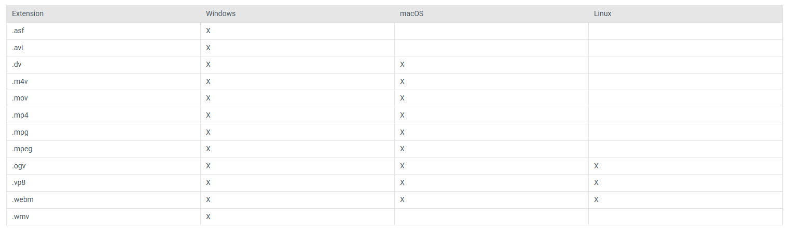

## How to use

- Download the latest release
- Install BepInEx
- extract the .zip file inside BepInEx/plugins
- put your videos inside BepInEx/plugins/SmartTV/Videos (support for mp4)

## Working features

- build SmartTV
- pause/play button
- next video button
- previous video button
- volume slider